<div align="center">

# 🎓 Student Management System

[](https://spring.io/projects/spring-boot)
[](https://openjdk.org/)
[](https://www.postgresql.org/)
[](https://www.docker.com/)
[](LICENSE)

**A comprehensive Student Management System built with Spring Boot, featuring role-based authentication, MVC architecture, and a modern responsive UI.**

[Features](#-features) •
[Screenshots](#-screenshots) •
[Getting Started](#-getting-started) •
[API Reference](#-api-endpoints)

---

</div>

## 📋 Table of Contents

- [Features](#-features)
- [Screenshots](#-screenshots)
- [Technology Stack](#-technology-stack)
- [Architecture](#-architecture)
- [Authentication vs Authorization](#-authentication-vs-authorization)
- [Project Structure](#-project-structure)
- [Database Schema](#-database-schema)
- [Getting Started](#-getting-started)
- [User Roles & Permissions](#-user-roles--permissions)
- [Demo Credentials](#-demo-credentials)
- [API Endpoints](#-api-endpoints)

---

## ✨ Features

<table>
<tr>
<td width="50%">

### 🔐 Security Features

- ✅ Spring Security implementation
- ✅ Role-based access control (RBAC)
- ✅ BCrypt password encoding
- ✅ Session management
- ✅ Protected routes

</td>
<td width="50%">

### 👨‍🎓 Student Features

- ✅ View personal profile
- ✅ View enrolled courses
- ✅ Enroll/Drop courses
- ✅ View department information
- ✅ Personalized dashboard

</td>
</tr>
<tr>
<td width="50%">

### 👨‍🏫 Teacher Features

- ✅ Full CRUD on Students
- ✅ Full CRUD on Teachers
- ✅ Full CRUD on Courses
- ✅ Full CRUD on Departments
- ✅ Admin dashboard

</td>
<td width="50%">

### 🎨 UI/UX Features

- ✅ Responsive design
- ✅ Modern interface
- ✅ Intuitive navigation
- ✅ Form validation
- ✅ Error handling

</td>
</tr>
</table>

---

## 📸 Screenshots

### 🔑 Authentication

<div align="center">
<table>
<tr>
<td align="center"><b>Login Page</b></td>
<td align="center"><b>Teacher Login</b></td>
</tr>
<tr>
<td>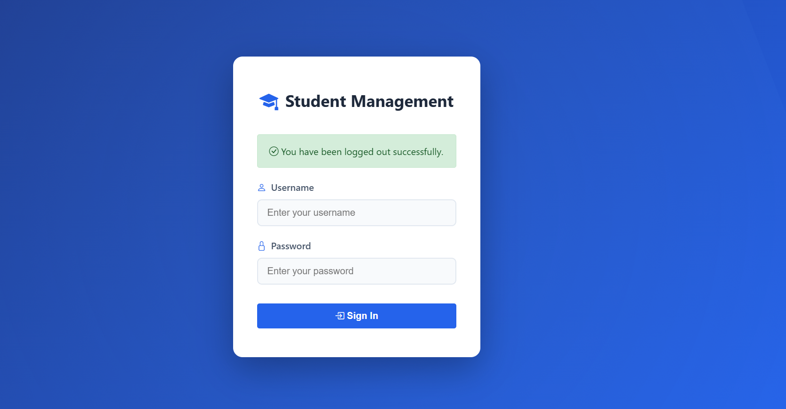</td>
<td>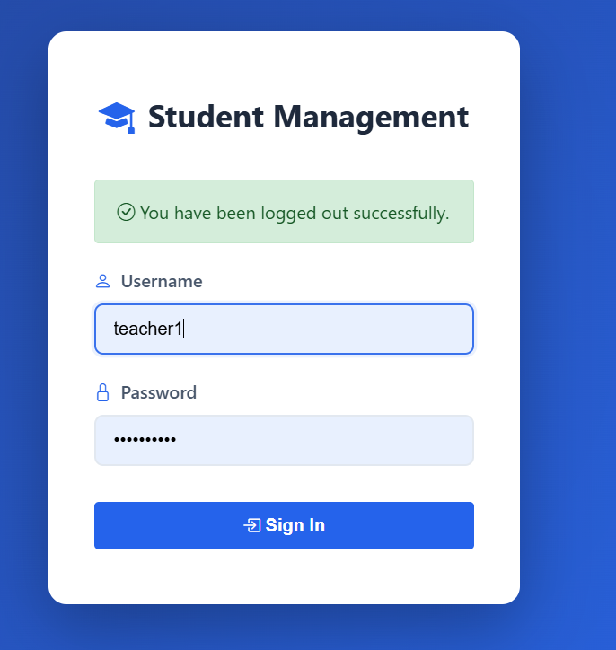</td>
</tr>
</table>
</div>

### 👨‍🏫 Teacher Dashboard & Management

<div align="center">
<table>
<tr>
<td align="center"><b>Teacher Dashboard</b></td>
<td align="center"><b>Teacher Dashboard View</b></td>
</tr>
<tr>
<td>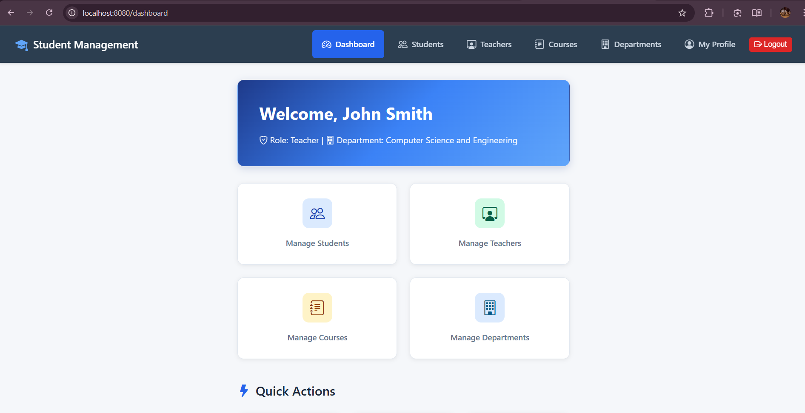</td>
<td>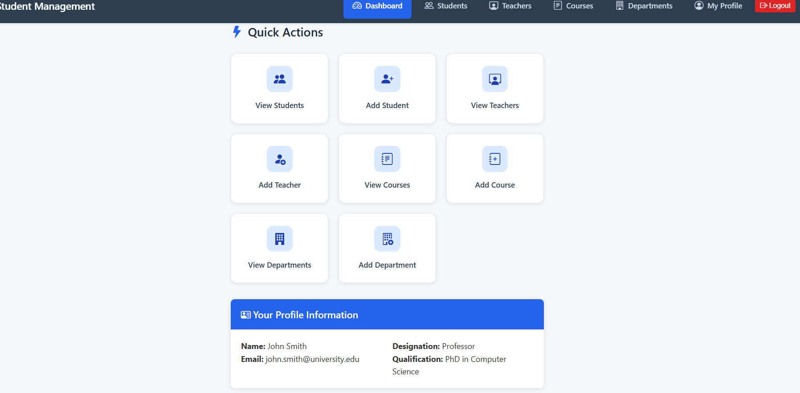</td>
</tr>
</table>
</div>

<div align="center">
<table>
<tr>
<td align="center"><b>Teachers List</b></td>
</tr>
<tr>
<td>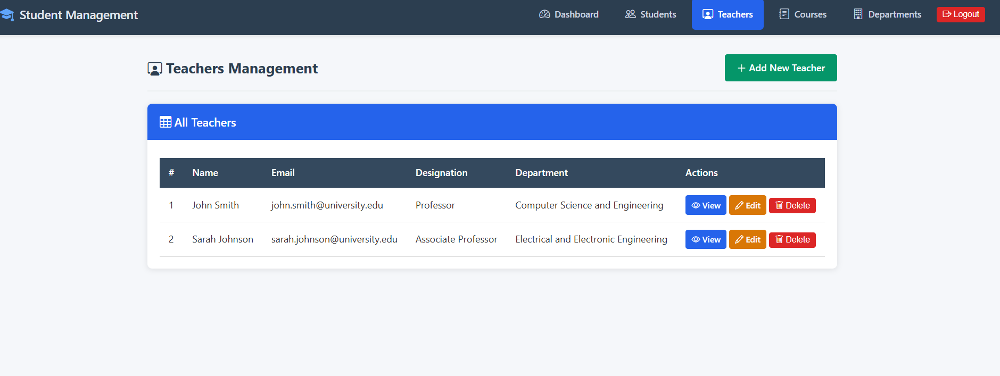</td>
</tr>
</table>
</div>

### 👨‍🎓 Student Management

<div align="center">
<table>
<tr>
<td align="center"><b>Students List</b></td>
<td align="center"><b>Add New Student</b></td>
</tr>
<tr>
<td>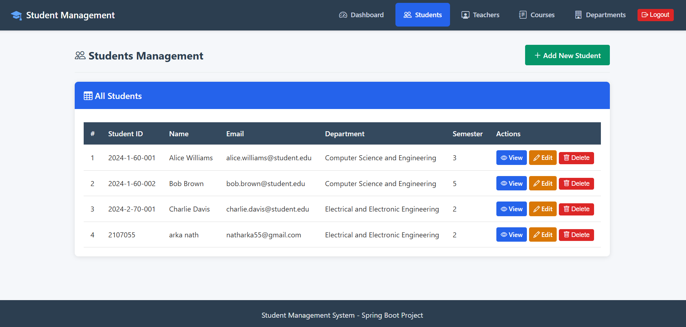</td>
<td>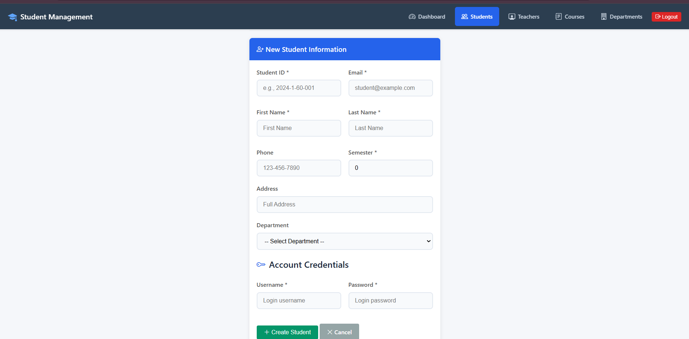</td>
</tr>
</table>
</div>

<div align="center">
<table>
<tr>
<td align="center"><b>Student Details</b></td>
<td align="center"><b>Edit Student</b></td>
</tr>
<tr>
<td>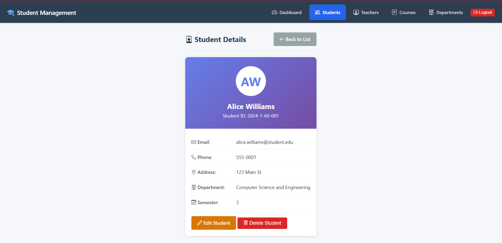</td>
<td>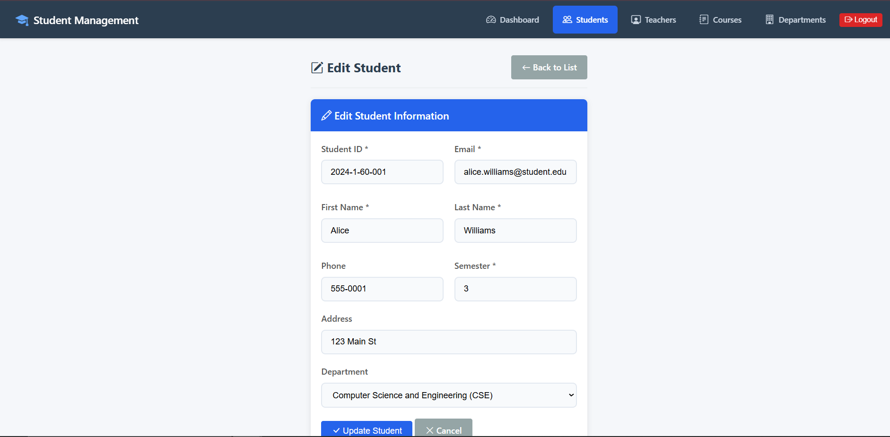</td>
</tr>
</table>
</div>

### 👤 Student Portal

<div align="center">
<table>
<tr>
<td align="center"><b>Student Dashboard</b></td>
<td align="center"><b>Student Profile</b></td>
</tr>
<tr>
<td>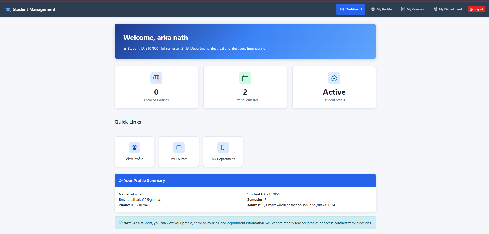</td>
<td>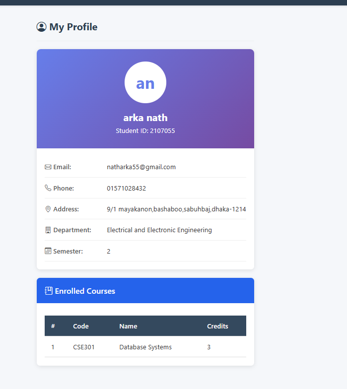</td>
</tr>
</table>
</div>

<div align="center">
<table>
<tr>
<td align="center"><b>My Courses</b></td>
<td align="center"><b>Department Details</b></td>
</tr>
<tr>
<td>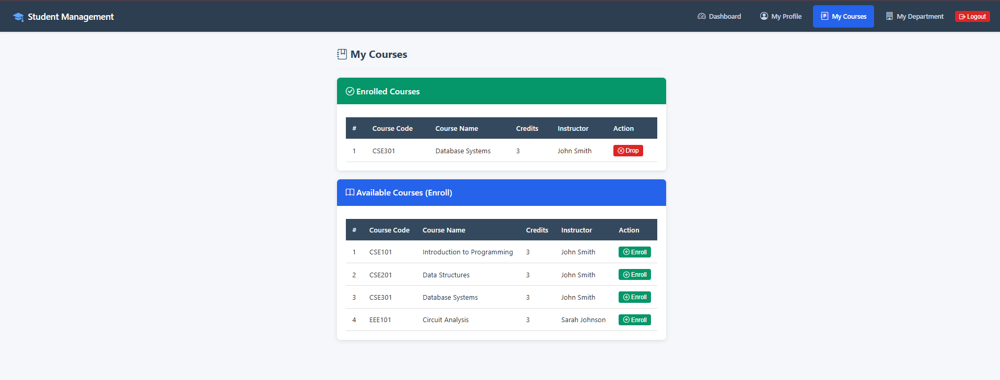</td>
<td>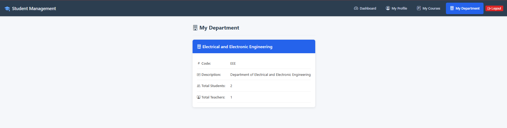</td>
</tr>
</table>
</div>

### 📚 Course & Department Management

<div align="center">
<table>
<tr>
<td align="center"><b>Courses List</b></td>
<td align="center"><b>Departments List</b></td>
</tr>
<tr>
<td>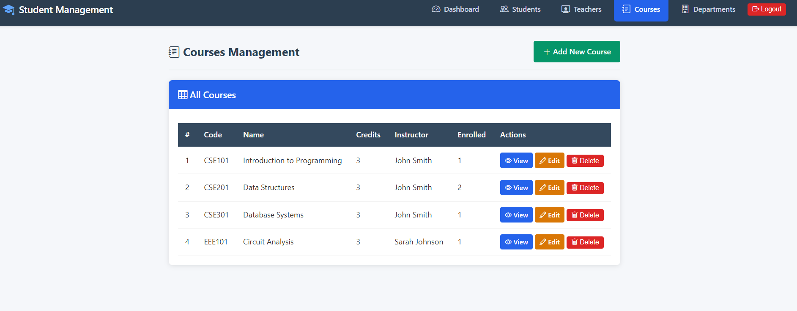</td>
<td>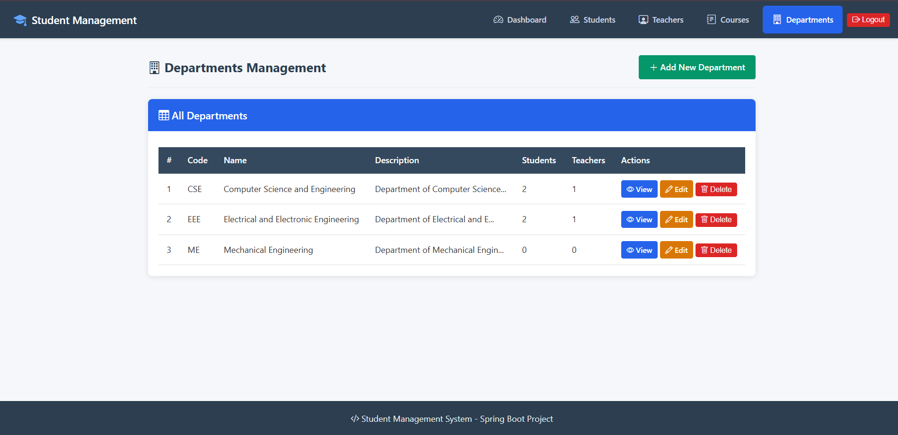</td>
</tr>
</table>
</div>

---

## 🛠 Technology Stack

<div align="center">

|                                                          Technology                                                           |            Purpose             | Version |
| :---------------------------------------------------------------------------------------------------------------------------: | :----------------------------: | :-----: |
|              |       Backend Framework        |  4.0.2  |
|  | Authentication & Authorization |   6.x   |
|                |            Database            |   16    |
|                   |        Template Engine         |   3.x   |
|                            |      Container Management      | Latest  |
|                         |           Build Tool           |  3.9+   |
|                            |     Boilerplate Reduction      | Latest  |
|                               |      Programming Language      |   21    |

</div>

---

## 🎨 Frontend & UI Design

### UI Technology Stack

|      Component      |                                                        Technology                                                        | Description                                                 |
| :-----------------: | :----------------------------------------------------------------------------------------------------------------------: | :---------------------------------------------------------- |
| **Template Engine** |              | Server-side Java template engine for dynamic HTML rendering |
|     **Styling**     |                             | Custom hand-written CSS (No CSS frameworks)                 |
|      **Icons**      |  | Modern icon library for UI elements                         |

### 🚫 No CSS Framework Used

This project intentionally uses **pure custom CSS** without any CSS frameworks like Bootstrap, Tailwind, or Bulma. This approach demonstrates:

- ✅ **Complete control** over styling and design
- ✅ **No external dependencies** for UI
- ✅ **Lightweight** - No bloated CSS files
- ✅ **Learning-focused** - Understanding core CSS concepts
- ✅ **Custom responsive design** from scratch

### UI Features

<table>
<tr>
<td width="50%">

**🎯 Design Principles**

- Clean and modern interface
- Consistent color scheme
- Intuitive navigation
- Card-based layouts
- Proper spacing and typography

</td>
<td width="50%">

**📱 Responsive Design**

- Flexbox layouts
- Mobile-friendly navigation
- Adaptive tables
- Responsive forms
- Fluid grid system

</td>
</tr>
</table>

### CSS Architecture

```
📂 static/css/
└── 🎨 style.css (800+ lines)
    ├── Reset & Base Styles
    ├── Navigation Components
    ├── Card Components
    ├── Form Styling
    ├── Table Styling
    ├── Button Components
    ├── Alert Messages
    ├── Dashboard Layouts
    └── Responsive Media Queries
```

### Thymeleaf Integration

The UI leverages Thymeleaf's powerful features:

```html
<!-- Dynamic content rendering -->
<span th:text="${student.name}">Student Name</span>

<!-- Conditional rendering based on roles -->
<div sec:authorize="hasRole('TEACHER')">Admin Content Here</div>

<!-- Iteration for lists -->
<tr th:each="student : ${students}">
  <td th:text="${student.email}">email@example.com</td>
</tr>

<!-- Form binding with Spring MVC -->
<form th:action="@{/students/create}" th:object="${student}" method="post">
  <input th:field="*{name}" type="text" />
</form>
```

---

## 🏗 Architecture

This project follows the **MVC (Model-View-Controller)** architecture pattern:

```
┌─────────────────────────────────────────────────────────────────────────┐
│                         🖥️  PRESENTATION LAYER                          │
│                          (Thymeleaf Templates)                          │
│   ┌─────────┐ ┌─────────┐ ┌─────────┐ ┌─────────┐ ┌─────────┐          │
│   │  Login  │ │ Student │ │ Teacher │ │ Course  │ │  Dept   │          │
│   │  Views  │ │  Views  │ │  Views  │ │  Views  │ │  Views  │          │
│   └─────────┘ └─────────┘ └─────────┘ └─────────┘ └─────────┘          │
└─────────────────────────────────────────────────────────────────────────┘
                                    ⬇️ ⬆️
┌─────────────────────────────────────────────────────────────────────────┐
│                         🎮  CONTROLLER LAYER                            │
│                                                                         │
│   HomeController │ StudentController │ TeacherController               │
│   CourseController │ DepartmentController                               │
└─────────────────────────────────────────────────────────────────────────┘
                                    ⬇️ ⬆️
┌─────────────────────────────────────────────────────────────────────────┐
│                          ⚙️  SERVICE LAYER                              │
│                                                                         │
│   StudentService │ TeacherService │ CourseService                      │
│   DepartmentService │ CustomUserDetailsService                         │
└─────────────────────────────────────────────────────────────────────────┘
                                    ⬇️ ⬆️
┌─────────────────────────────────────────────────────────────────────────┐
│                         💾  REPOSITORY LAYER                            │
│                                                                         │
│   StudentRepository │ TeacherRepository │ CourseRepository             │
│   DepartmentRepository │ UserRepository │ RoleRepository               │
└─────────────────────────────────────────────────────────────────────────┘
                                    ⬇️ ⬆️
┌─────────────────────────────────────────────────────────────────────────┐
│                         🗄️  DATABASE LAYER                              │
│                           (PostgreSQL 16)                               │
└─────────────────────────────────────────────────────────────────────────┘
```

---

## 🔐 Authentication vs Authorization

<div align="center">

|    Aspect    |       🔑 Authentication       |       🛡️ Authorization       |
| :----------: | :---------------------------: | :--------------------------: |
| **Purpose**  |        Verify identity        |      Grant/deny access       |
| **Question** |       _"Who are you?"_        |     _"What can you do?"_     |
|  **Order**   |         Happens first         | Happens after authentication |
|  **Method**  | Username/Password, Biometrics | Roles, Permissions, Policies |
| **Failure**  |      `401 Unauthorized`       |       `403 Forbidden`        |

</div>

### 🔑 Authentication: "Who are you?"

**Authentication** is the process of verifying the identity of a user, device, or system.

- User provides credentials (username/password)
- System validates these credentials against stored data
- If valid, the user is authenticated

**In this application:**

- Users login with username and password
- `CustomUserDetailsService` loads user from database
- Spring Security verifies password using BCrypt encoder

### 🛡️ Authorization: "What are you allowed to do?"

**Authorization** is the process of determining what actions an authenticated user is permitted to perform.

- Happens AFTER authentication
- Based on user's role or permissions

**In this application:**

- Users have roles: `ROLE_TEACHER` or `ROLE_STUDENT`
- Teachers can access all CRUD operations
- Students can only view their own profile and courses

---

## 📁 Project Structure

<details>
<summary>📂 Click to expand project structure</summary>

```
📦 studentManagementSystem
├── 📄 pom.xml                          # Maven configuration
├── 📄 compose.yaml                     # Docker Compose configuration
├── 📂 src/main/java/com/example/studentManagementSystem/
│   ├── 📄 StudentManagementSystemApplication.java
│   ├── 📂 config/
│   │   ├── 🔒 SecurityConfig.java      # Spring Security configuration
│   │   └── 📊 DataInitializer.java     # Sample data loader
│   ├── 📂 controller/
│   │   ├── 🏠 HomeController.java      # Dashboard and login
│   │   ├── 👨‍🎓 StudentController.java   # Student CRUD
│   │   ├── 👨‍🏫 TeacherController.java   # Teacher CRUD
│   │   ├── 📚 CourseController.java    # Course CRUD
│   │   └── 🏛️ DepartmentController.java # Department CRUD
│   ├── 📂 dto/
│   │   ├── StudentDTO.java
│   │   ├── TeacherDTO.java
│   │   ├── CourseDTO.java
│   │   └── DepartmentDTO.java
│   ├── 📂 entity/
│   │   ├── User.java                   # User entity for authentication
│   │   ├── Role.java                   # Role entity
│   │   ├── Student.java
│   │   ├── Teacher.java
│   │   ├── Course.java
│   │   └── Department.java
│   ├── 📂 repository/
│   │   ├── UserRepository.java
│   │   ├── RoleRepository.java
│   │   ├── StudentRepository.java
│   │   ├── TeacherRepository.java
│   │   ├── CourseRepository.java
│   │   └── DepartmentRepository.java
│   └── 📂 service/
│       ├── CustomUserDetailsService.java
│       ├── StudentService.java
│       ├── TeacherService.java
│       ├── CourseService.java
│       └── DepartmentService.java
└── 📂 src/main/resources/
    ├── 📄 application.properties
    ├── 📂 static/css/
    │   └── 🎨 style.css
    └── 📂 templates/
        ├── 🔐 login.html
        ├── ⛔ access-denied.html
        ├── ℹ️ about.html
        ├── 📂 student/
        ├── 📂 teacher/
        ├── 📂 course/
        └── 📂 department/
```

</details>

---

## 🗄 Database Schema

### Entity Relationships

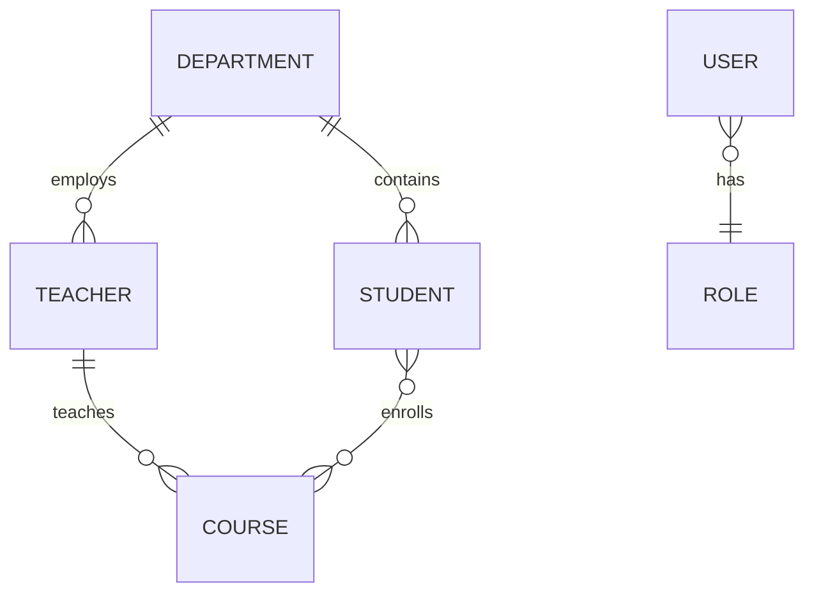

```
┌──────────────┐     1:M     ┌──────────────┐
│  Department  │────────────▶│   Student    │
└──────────────┘             └──────────────┘
       │                            │
       │ 1:M                        │ M:M
       ▼                            ▼
┌──────────────┐     1:M     ┌──────────────┐
│   Teacher    │────────────▶│    Course    │
└──────────────┘             └──────────────┘

┌──────────────┐     M:1     ┌──────────────┐
│     User     │────────────▶│     Role     │
└──────────────┘             └──────────────┘
```

### 📊 Tables

| Table             | Description                             |
| ----------------- | --------------------------------------- |
| `users`           | System users for authentication         |
| `roles`           | User roles (ROLE_STUDENT, ROLE_TEACHER) |
| `departments`     | Academic departments                    |
| `teachers`        | Teacher information                     |
| `students`        | Student information                     |
| `courses`         | Course information                      |
| `student_courses` | Many-to-many relationship table         |

---

## 🚀 Getting Started

### Prerequisites

<table>
<tr>
<td>

| Requirement   | Version                  |
| ------------- | ------------------------ |
| ☕ Java       | 21+ (for local dev)      |
| 📦 Maven      | 3.9+ (for local dev)     |
| 🐳 Docker     | Latest                   |
| 🐘 PostgreSQL | 16 (if not using Docker) |

</td>
</tr>
</table>

### Option 1: Full Docker Deployment (Recommended) 🐳

Run the entire application stack (Spring Boot + PostgreSQL) in containers:

```bash
# Build and start all services
docker-compose up -d --build

# View logs
docker-compose logs -f

# Stop all services
docker-compose down
```

🌐 Access the application at [http://localhost:8080](http://localhost:8080)

**Docker Services:**
| Service | Container Name | Port |
|---------|----------------|------|
| Spring Boot App | `student_management_app` | 8080 |
| PostgreSQL DB | `student_management_db` | 5432 |

### Option 2: Docker Database + Local App 🐳 + ☕

Run only the database in Docker, application locally (good for development):

1. **Start PostgreSQL container:**

   ```bash
   docker-compose up -d postgres
   ```

2. **Run the application locally:**

   ```bash
   ./mvnw spring-boot:run
   ```

3. **Access the application:**

   🌐 Open [http://localhost:8080](http://localhost:8080) in your browser

### Option 3: Local PostgreSQL 🐘

1. **Create database:**

   ```sql
   CREATE DATABASE student_management;
   CREATE USER arka WITH PASSWORD 'arka';
   GRANT ALL PRIVILEGES ON DATABASE student_management TO arka;
   ```

2. **Run the application:**

   ```bash
   ./mvnw spring-boot:run
   ```

3. **Access the application:**

   🌐 Open [http://localhost:8080](http://localhost:8080) in your browser

---

## 👥 User Roles & Permissions

<div align="center">

### 🎓 ROLE_STUDENT

| Permission             | Allowed |
| :--------------------- | :-----: |
| View own profile       |   ✅    |
| View department        |   ✅    |
| View enrolled courses  |   ✅    |
| Enroll/Drop courses    |   ✅    |
| Modify teacher info    |   ❌    |
| Access admin endpoints |   ❌    |
| CRUD operations        |   ❌    |

### 👨‍🏫 ROLE_TEACHER

| Permission                | Allowed |
| :------------------------ | :-----: |
| Manage students (CRUD)    |   ✅    |
| Manage teachers (CRUD)    |   ✅    |
| Manage courses (CRUD)     |   ✅    |
| Manage departments (CRUD) |   ✅    |
| Update own profile        |   ✅    |
| Access all endpoints      |   ✅    |

</div>

---

## 🔑 Demo Credentials

<div align="center">

|    Role    |  Username  |   Password   |
| :--------: | :--------: | :----------: |
| 👨‍🏫 Teacher | `teacher1` | `teacher123` |
| 👨‍🏫 Teacher | `teacher2` | `teacher123` |
| 🎓 Student | `student1` | `student123` |
| 🎓 Student | `student2` | `student123` |
| 🎓 Student | `student3` | `student123` |

</div>

---

## 🌐 API Endpoints

All CRUD operations use **POST** requests as specified.

### Public Endpoints

| Method | URL      | Description                |
| ------ | -------- | -------------------------- |
| GET    | `/`      | Home page (redirects)      |
| GET    | `/login` | Login page                 |
| GET    | `/about` | About page (Auth vs Authz) |

### Student Endpoints (Student Role)

| Method | URL                       | Description           |
| ------ | ------------------------- | --------------------- |
| GET    | `/students/profile`       | View own profile      |
| GET    | `/students/my-courses`    | View enrolled courses |
| GET    | `/students/my-department` | View department info  |
| POST   | `/students/enroll/{id}`   | Enroll in course      |
| POST   | `/students/drop/{id}`     | Drop course           |

### Admin Endpoints (Teacher Role)

#### Students

| Method | URL                     | Description       |
| ------ | ----------------------- | ----------------- |
| GET    | `/students`             | List all students |
| GET    | `/students/new`         | Create form       |
| GET    | `/students/edit/{id}`   | Edit form         |
| GET    | `/students/view/{id}`   | View details      |
| POST   | `/students/create`      | Create student    |
| POST   | `/students/update/{id}` | Update student    |
| POST   | `/students/delete/{id}` | Delete student    |

#### Teachers

| Method | URL                        | Description        |
| ------ | -------------------------- | ------------------ |
| GET    | `/teachers`                | List all teachers  |
| GET    | `/teachers/new`            | Create form        |
| GET    | `/teachers/edit/{id}`      | Edit form          |
| GET    | `/teachers/view/{id}`      | View details       |
| GET    | `/teachers/profile`        | Own profile        |
| POST   | `/teachers/create`         | Create teacher     |
| POST   | `/teachers/update/{id}`    | Update teacher     |
| POST   | `/teachers/delete/{id}`    | Delete teacher     |
| POST   | `/teachers/profile/update` | Update own profile |

#### Courses

| Method | URL                    | Description      |
| ------ | ---------------------- | ---------------- |
| GET    | `/courses`             | List all courses |
| GET    | `/courses/new`         | Create form      |
| GET    | `/courses/edit/{id}`   | Edit form        |
| GET    | `/courses/view/{id}`   | View details     |
| POST   | `/courses/create`      | Create course    |
| POST   | `/courses/update/{id}` | Update course    |
| POST   | `/courses/delete/{id}` | Delete course    |

#### Departments

| Method | URL                        | Description          |
| ------ | -------------------------- | -------------------- |
| GET    | `/departments`             | List all departments |
| GET    | `/departments/new`         | Create form          |
| GET    | `/departments/edit/{id}`   | Edit form            |
| GET    | `/departments/view/{id}`   | View details         |
| POST   | `/departments/create`      | Create department    |
| POST   | `/departments/update/{id}` | Update department    |
| POST   | `/departments/delete/{id}` | Delete department    |

---

## 🤝 Contributing

Contributions are welcome! Please feel free to submit a Pull Request.

1. Fork the repository
2. Create your feature branch (`git checkout -b feature/AmazingFeature`)
3. Commit your changes (`git commit -m 'Add some AmazingFeature'`)
4. Push to the branch (`git push origin feature/AmazingFeature`)
5. Open a Pull Request

---

## 📝 License

This project is created for educational purposes as part of a Software Engineering & Project Management Laboratory course.

---

<div align="center">

## 👨‍💻 Author

**Arka Braja Prasad Nath**

[](https://github.com/AriyaArKa)

---

Made with ❤️ using Spring Boot

⭐ Star this repository if you found it helpful!

</div>
